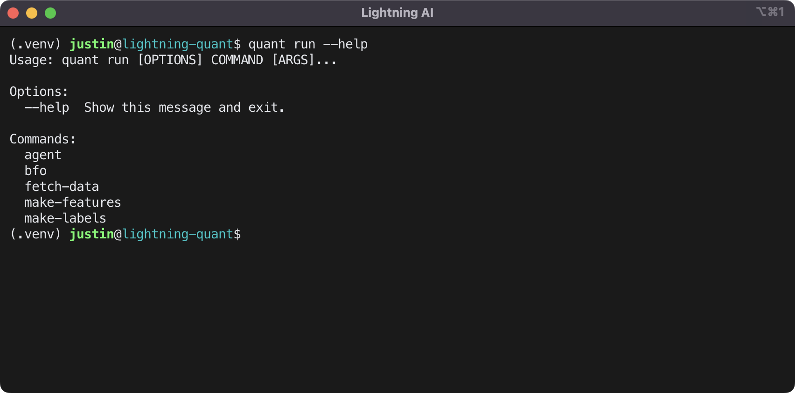

          
Okay, here is the content of the <mcfile name="README.md" path="/Users/cheencheen/Downloads/light-quant-main/README.md"></mcfile> file based on the provided context. Since I don't have the specific diff of the changes made previously, I'm showing the relevant sections as they appear in the context.

```markdown:/Users/cheencheen/Downloads/light-quant-main/README.md
# Lightning Quant

<!-- # Copyright Justin R. Goheen.
#
# Licensed under the Apache License, Version 2.0 (the "License");
# you may not use this file except in compliance with the License.
# You may obtain a copy of the License at
#
#     http://www.apache.org/licenses/LICENSE-2.0
#
# Unless required by applicable law or agreed to in writing, software
# distributed under the License is distributed on an "AS IS" BASIS,
# WITHOUT WARRANTIES OR CONDITIONS OF ANY KIND, either express or implied.
# See the License for the specific language governing permissions and
# limitations under the License. -->

Lightning Quant is a library for algorithmic trading agents built with [Lightning AI](https://lightning.ai/) ecosystem projects Nixtla's [neuralforecast](https://github.com/Nixtla/neuralforecast) and Eclectic Sheep's [SheepRL](https://github.com/Eclectic-Sheep/sheeprl). [Alpaca Markets](https://alpaca.markets/) is used to fetch the historical data for the exercise.

Lightning AI's PyTorch Lightning and Lightning Fabric are agnostic to the market broker and data source. One needs only to acquire and preprocess the desired market data and then construct the requisite PyTorch DataLoaders and LightningDataModule for the PyTorch Lightning Trainer or Lightning Fabric training loop that will be used with the bespoke PyTorch model, a SheepRL algorithm, or a neuralforecast model.

[SPY](https://www.google.com/finance/quote/SPY:NYSEARCA?sa=X&ved=2ahUKEwjQ-MKp5az_AhV2mYQIHXfxCu4Q3ecFegQIJRAX) (S&P 500) is used in examples.

## Setup

First – fork, then clone the repo. After cloning the repo to your machine, do the following in terminal to navigate to your clone:

```sh
cd {{ path to clone }}
```

> **Note**
>
> SheepRL requires a Python version less than 3.11 and greater than or equal to 3.8.

If you have Python 3.10, 3.9, or 3.8 as system Python, you can create and activate a virtual environment with:

```sh
python3 -m venv .venv
source .venv/bin/activate
```

If you have Python 3.11 or later as system Python, but have [homebrew](https://brew.sh/) installed, you can install Python 3.10 and then create the venv with:

```sh
brew install python@3.10
python3.10 -m venv .venv
source .venv/bin/activate
```

If you have Python 3.11 or later as system Python, but have [conda](https://docs.conda.io/en/latest/) or [miniconda](https://docs.conda.io/en/latest/miniconda.html) installed, create the conda env with:

```sh
conda create -n lit-quant python=3.10 -y
conda activate lit-quant
```

Then, install an editable version of lightning-quant with:

```sh
pip install -e .
```

> **Note**
>
> ensure your venv or conda env is activated before proceeding

> **Note**
>
> the example uses pip regardless of if you've created your env with venv or conda

> **Note**
>
> if you are on an Apple Silicon powered MacBook and encounter an error attributed box2dpy during install, you need to install SWIG using the instructions shown below to support gym and gymnasium.

It is recommended to use [homebrew](https://brew.sh/) to install [SWIG](https://formulae.brew.sh/formula/swig) to support [Gym](https://github.com/openai/gym).

```sh
# if needed, install homebrew
/bin/bash -c "$(curl -fsSL https://raw.githubusercontent.com/Homebrew/install/HEAD/install.sh)"
# then, do
brew install swig
# then attempt to pip install again
pip install -e .
```

## Requirements

The instructions shown above will install the base requirements, those requirements are:

- PyTorch
- [Lightning Fabric](https://lightning.ai/docs/fabric/stable/)
- [TorchMetrics](https://torchmetrics.readthedocs.io/en/stable/)
- [Weights and Biases](https://docs.wandb.ai/guides): Experiment Manager
- [alpaca-py](https://alpaca.markets/docs/python-sdk/): Alpaca Markets Python API
- [neuralforecast](https://github.com/Nixtla/neuralforecast): neural forecasting models created by Nixtla
- [Ploty](https://plotly.com/python/): Data Visualization
- [Click](https://click.palletsprojects.com/): Command Line Interfaces

## Additional Requirements

> **Note**
>
> To install the Cython version of TA-Lib, you must first install the SWIG version.

```sh
# if needed, install homebrew
/bin/bash -c "$(curl -fsSL https://raw.githubusercontent.com/Homebrew/install/HEAD/install.sh)"
# then, do
brew install ta-lib
# then install Cython Ta-Lib
pip install TA-lib
```

## Using Lightning-Quant

Lightning-Quant provides a CLI, `quant`. The available commands for `quant` are shown below.



To run data acquisition, feature engineering, brute force optimization, and label generation at one time, do:

```sh
quant run agent --key-YOUR-ALPACA-KEY --secret=YOUR-ALPACA-SECRET-KEY --symbol=SPY
```

Alternatively, you can create a .env file and lightning-quant will automatically load the provided environment variables for you. And then use the following in terminal:

```sh
quant run agent --symbol=SPY --tasks=all
```


> **Warning**
>
> do not commit your .env files to GitHub

The contents of your `.env` file should be:

```txt
API_KEY=YOUR_API_KEY
SECRET_KEY=YOUR_SECRET_KEY
```


        